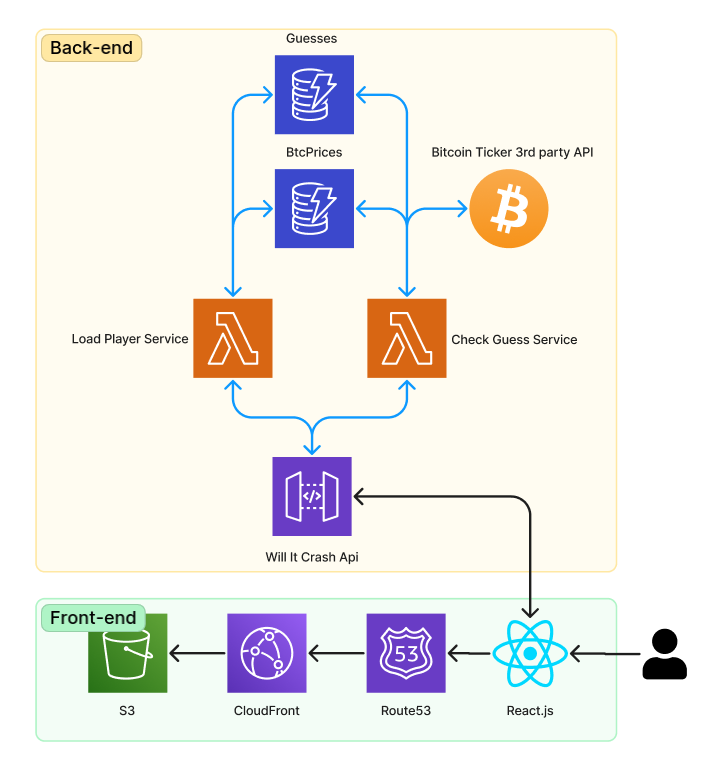
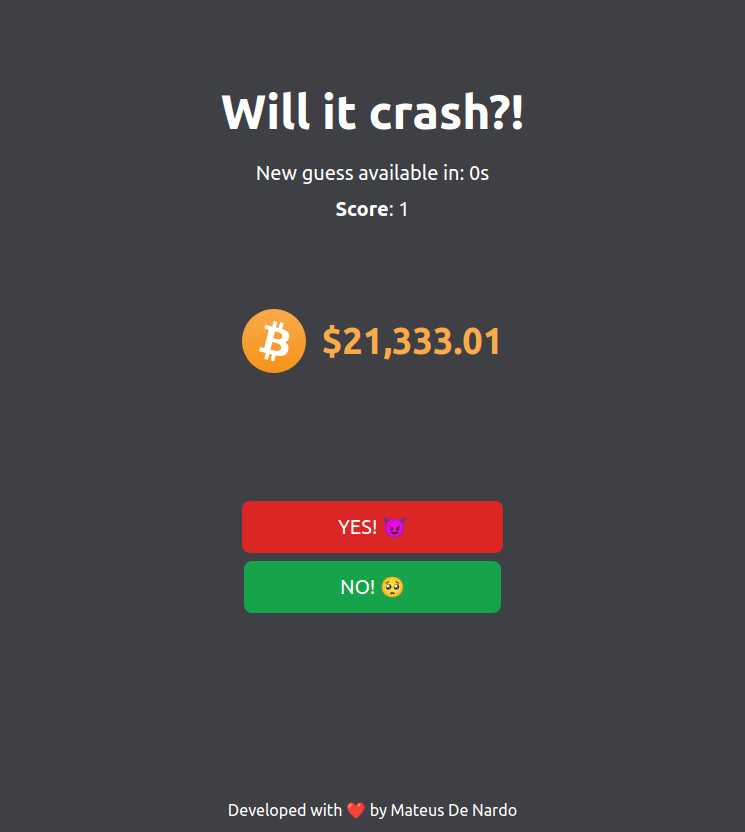

# will-it-crash

The back-end repository of this application can be found [here](https://github.com/mdnm/will-it-crash-api)

The application is deployed and delivered through AWS using S3, CloudFront and Route53.



## About



**Will it Crash** is a simple game where you try to guess if the Bitcoin price will rise or crash in the next minute.

The rules are:

- New players start with the score of 0;
- You can guess if the price will crash by clicking the **YES** button and guessing the opposite by clicking the **NO** button;
- After one minute, your guess will be checked and if your answer is right you'll **earn 1 point**, but, you'll **lose 1 point** otherwise;
- You can't make a new guess until the last you've made was checked.

The Bitcoin price is verified using the [Bitfinex Ticker API](https://docs.bitfinex.com/v1/v1/reference#rest-public-ticker)

You can visit the production application by going to [https://willitcrash.co.uk](https://willitcrash.co.uk)

## Deploy

This application uses [Vite](https://vitejs.dev) for it's tooling.

To build your application, run the following in your shell:

```bash
$ vite build
```

A `dist` folder will be created containing the build source code.
You can deploy this code to an AWS S3 Bucket, just remember to invalidate your CloudFront distribution.

A Github Action CI/CD pipeline is also available in this repo, just make sure you create the following secrets:

- `API_ENDPOINT`
- `AWS_ACCESS_KEY_ID`
- `AWS_ACCESS_KEY_SECRET`
- `CLOUDFRONT_DISTRIBUTION_ID`
- `S3_BUCKET`
- `S3_BUCKET_REGION`

## Running and testing locally

To start a local development server you first need to create an `.env.local` file containing a `VITE_API_ENDPOINT` variable that points to your WillItCrashAPI

Then, you can run the following command to start your server locally on port 3000 by default.

```bash
$ npm run dev
```
